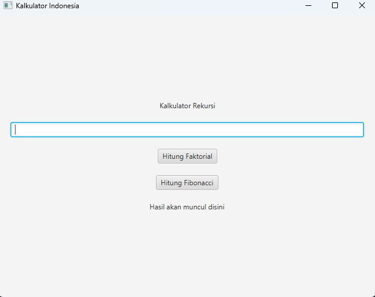

# JavaFX GUI Sederhana - Faktorial & Fibonacci (Rekursi)

Project aplikasi GUI sederhana mata kuliah algoritma 2 menggunakan JavaFX.

---

## Fitur Program

- Menghitung Faktorial dari sebuah angka
- Menghitung Deret Fibonacci sampai angka tertentu
- Menggunakan konsep Rekursi (Recursive Method)
- Tampilan sederhana menggunakan JavaFX GUI

---

## Cara Menjalankan Program

1. Clone repository ini:

```
git clone https://github.com/Xyzting/kalkulator-rekursi.git
```

2. Buka project di IDE seperti:

   - IntelliJ IDEA
   - NetBeans
   - VSCode

3. Pastikan sudah install Java & JavaFX.

4. Jalankan program:

```
Run App.java
```

---

## Contoh Tampilan Program



---

## About

- Nama : Reyhan Fathir Alamsyah
- NIM : 24552011032
- Mata Kuliah : Algoritma 2
